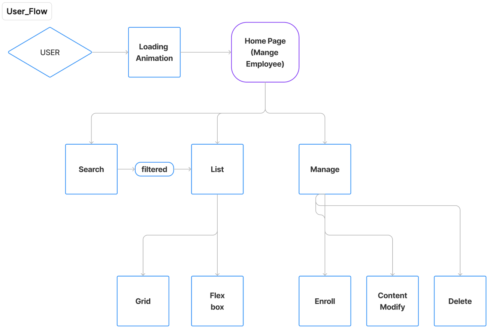
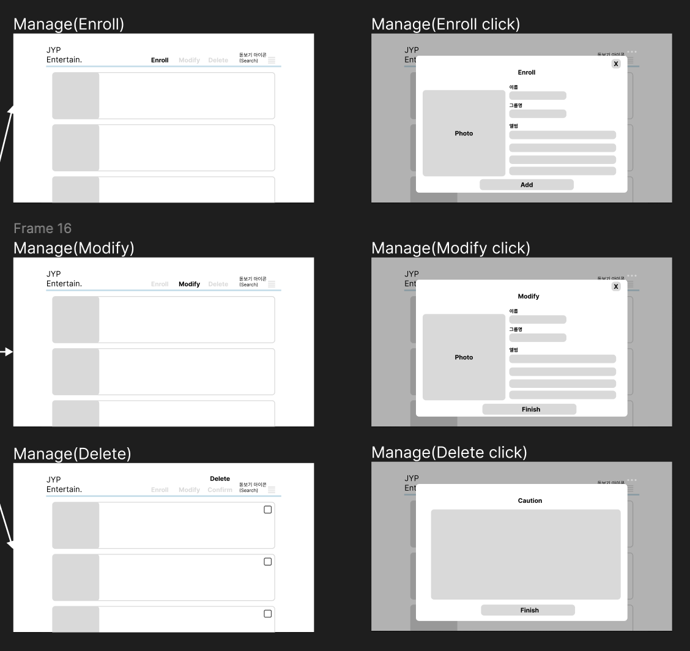

# **[ 직원 관리 서비스 ]**

✔️ 난이도 : ⭐️⭐️

</aside>

### **<과제 수행 및 제출 방법>**

### **<필수 요구사항>**

#### <페이지>
1. 로딩 페이지(애니메이션)
1. 프로필 페이지
- 스크롤이 가능한 형태의 리스팅 페이지
- 전체 페이지 데스크탑-모바일 반응형 페이지

#### <기능>
- 사진 등록, ~~삭제~~, ~~수정~~, 편집(선택)
- ~~직원 검색 기능~~
- infinity scroll 기능
- LocalStorage
- CSS
    - 상대수치 사용(rem, em)
- JavaScript
    - DOM event 조작

[설계링크(피그마)](https://www.figma.com/file/V9QBveJLeCysuGYaHyDeOe/UserFlow?type=design&node-id=0%3A1&mode=dev&t=ab7GH27PU6AErqYb-1)

전체적인 화면 구성은 다음과 같다.

리스트를 grid를 선택하는지, list를 선택하는지에 따라 배열이 달라진다. 
 

Manage 버튼을 클릭할 경우 

Modal의 크기는 똑같이 하며, 무엇을 클릭하느냐에 따라 내용이 달라진다.
___
## 오류
1. 이름 검색이 안된다.